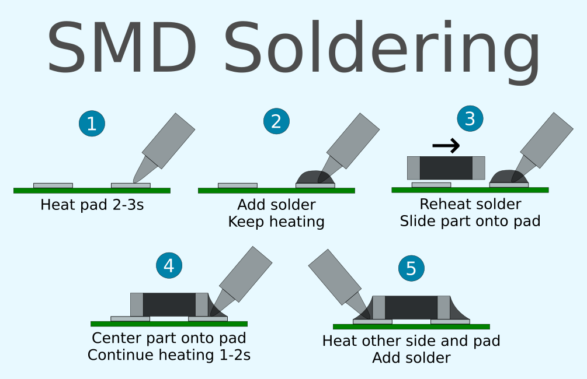
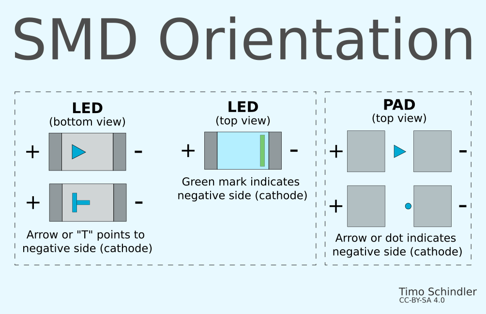
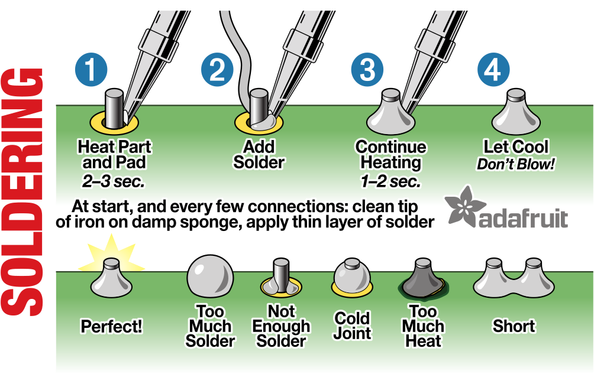
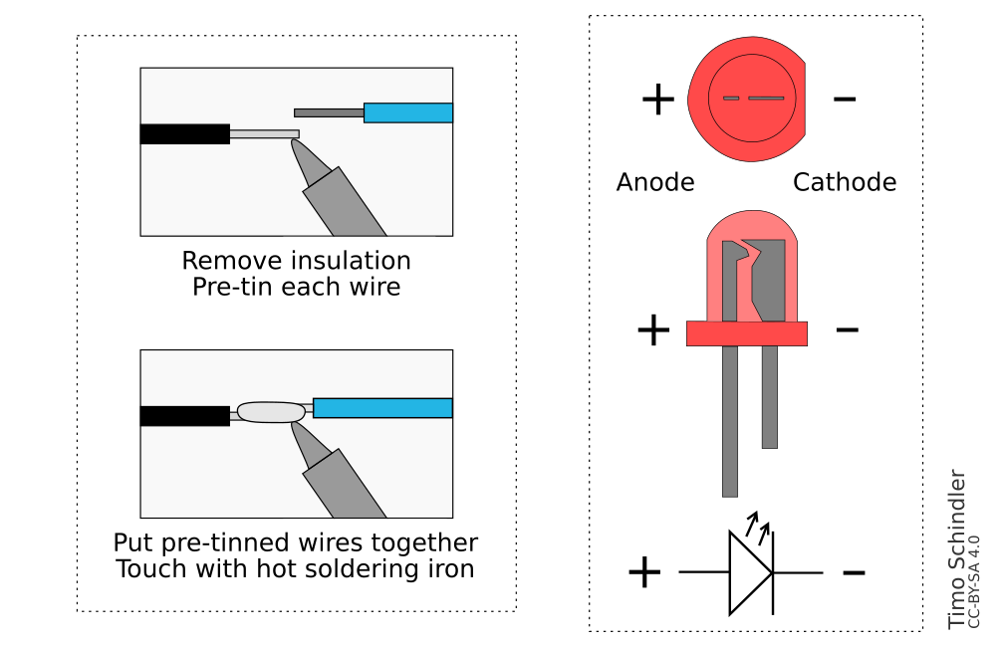

# Sodlering Reference Cards

Designed to be added to soldering kits or soldering courses to get a cheat sheet for the participants.
Use 85x55mm business-card prints.

## SMD Reference Card
 

## THT Reference Card
 

## Resources and Licence

- THT Front: [CC-BY-SA 4.0](https://creativecommons.org/licenses/by-sa/4.0/) [Adafruit](https://github.com/adafruit/Reference-Cards)
- THT Back (LED): Public Domain [Wikipedia](https://de.wikipedia.org/wiki/Datei:%2B-_of_Led.svg)
- Rest: [CC-BY-SA 4.0](https://creativecommons.org/licenses/by-sa/4.0/) - Timo Schindler
